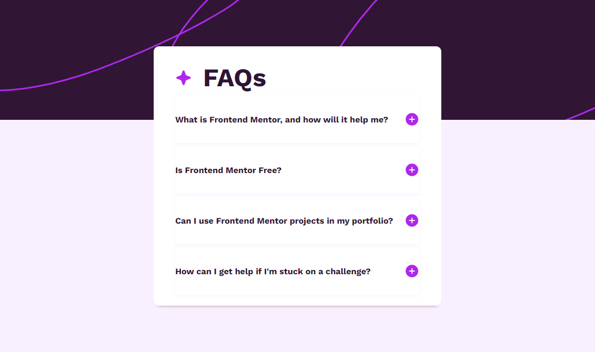

# Frontend Mentor - FAQ accordion solution

This is a solution to the [FAQ accordion challenge on Frontend Mentor](https://www.frontendmentor.io/challenges/faq-accordion-wyfFdeBwBz). Frontend Mentor challenges help you improve your coding skills by building realistic projects. 

## Table of contents

- [Overview](#overview)
  - [The challenge](#the-challenge)
  - [Screenshot](#screenshot)
  - [Links](#links)
- [My process](#my-process)
  - [Built with](#built-with)
  - [What I learned](#what-i-learned)
  - [Continued development](#continued-development)
- [Author](#author)

## Overview

### The challenge

Users should be able to:

- Hide/Show the answer to a question when the question is clicked
- Navigate the questions and hide/show answers using keyboard navigation alone
- View the optimal layout for the interface depending on their device's screen size
- See hover and focus states for all interactive elements on the page

### Screenshot

### Links

- [Repository of the solution](https://github.com/EnzoDev10/FAQ-accordion)
- [Live Site](https://enzodev10.github.io/FAQ-accordion/)

## My process

### Built with

- Semantic HTML5 markup
- Less Pre-processor
- Flexbox
- CSS animations
- Vanilla JavaScript
- Mobile-first workflow

### What I learned

With this project i learned how to use JQuery and Less. I already had experience with other pre-processor so it was really easy to understand less and even though it was easy the experience was fun and a good implementation to my toolbox. JQuery was something almost completely new to me, as i don't have a lot of experience with JS but the challenge of understanding it was a good test for my learning ability.

### Continued development

In future projects i would like to learn more JavaScript because i noticed that i got stuck multiple times on simple problems and i think is time to get even deeper in this language.

## Author

- Frontend Mentor - [@EnzoDev10](https://www.frontendmentor.io/profile/EnzoDev10)

